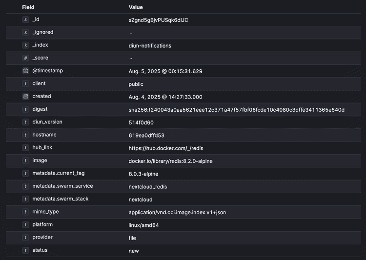

# Elasticsearch notifications

Send notifications to your Elasticsearch cluster as structured documents.

## Configuration

!!! example "File"
    ```yaml
    notif:
      elasticsearch:
        scheme: https
        host: localhost
        port: 9200
        username: elastic
        password: password
        client: diun
        index: diun-notifications
        timeout: 10s
        insecureSkipVerify: false
    ```

| Name                 | Default              | Description                                                         |
| -------------------- | -------------------- | ------------------------------------------------------------------- |
| `scheme`[^1]         | `http`               | Elasticsearch scheme (`http` or `https`)                            |
| `host`[^1]           | `localhost`          | Elasticsearch host                                                  |
| `port`[^1]           | `9200`               | Elasticsearch port                                                  |
| `username`           |                      | Elasticsearch username for authentication                           |
| `usernameFile`       |                      | Use content of secret file as username if `username` is not defined |
| `password`           |                      | Elasticsearch password for authentication                           |
| `passwordFile`       |                      | Use content of secret file as password if `password` is not defined |
| `client`[^1]         | `diun`               | Client name to identify the source of notifications                 |
| `index`[^1]          | `diun-notifications` | Elasticsearch index name where notifications will be stored         |
| `timeout`[^1]        | `10s`                | Timeout specifies a time limit for the request to be made           |
| `insecureSkipVerify` | `false`              | Skip TLS certificate verification                                   |

!!! abstract "Environment variables"
    * `DIUN_NOTIF_ELASTICSEARCH_SCHEME`
    * `DIUN_NOTIF_ELASTICSEARCH_HOST`
    * `DIUN_NOTIF_ELASTICSEARCH_PORT`
    * `DIUN_NOTIF_ELASTICSEARCH_USERNAME`
    * `DIUN_NOTIF_ELASTICSEARCH_USERNAMEFILE`
    * `DIUN_NOTIF_ELASTICSEARCH_PASSWORD`
    * `DIUN_NOTIF_ELASTICSEARCH_PASSWORDFILE`
    * `DIUN_NOTIF_ELASTICSEARCH_CLIENT`
    * `DIUN_NOTIF_ELASTICSEARCH_INDEX`
    * `DIUN_NOTIF_ELASTICSEARCH_TIMEOUT`
    * `DIUN_NOTIF_ELASTICSEARCH_INSECURESKIPVERIFY`

## Document Structure

Each notification is stored as a JSON document with following structure:

```json
{
  "diun_version": "4.24.0",
  "hostname": "myserver",
  "status": "new",
  "provider": "file",
  "image": "docker.io/crazymax/diun:latest",
  "hub_link": "https://hub.docker.com/r/crazymax/diun",
  "mime_type": "application/vnd.docker.distribution.manifest.list.v2+json",
  "digest": "sha256:216e3ae7de4ca8b553eb11ef7abda00651e79e537e85c46108284e5e91673e01",
  "created": "2020-03-26T12:23:56Z",
  "platform": "linux/amd64",
  "client": "diun",
  "metadata": {
    "ctn_command": "diun serve",
    "ctn_createdat": "2022-12-29 10:22:15 +0100 CET",
    "ctn_id": "0dbd10e15b31add2c48856fd34451adabf50d276efa466fe19a8ef5fbd87ad7c",
    "ctn_names": "diun",
    "ctn_size": "0B",
    "ctn_state": "running",
    "ctn_status": "Up Less than a second (health: starting)"
  }
}
```

## Sample



[^1]: Value required
